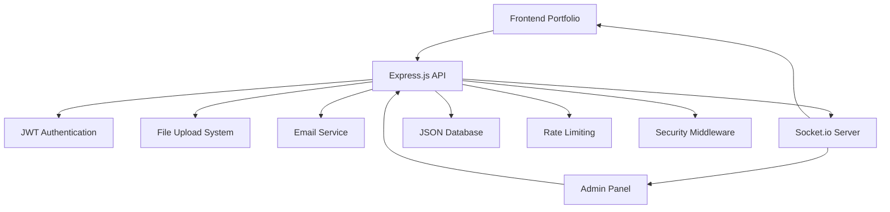

# 🚀 Professional Portfolio Management System

<div align="center">


**A complete full-stack portfolio solution with powerful admin panel, real-time updates, and JWT authentication**

[](https://yohannesweb.netlify.app)
[](https://yohannesweb.netlify.app/admin)
[](LICENSE)


</div>

---

## 🎯 **What Makes This Special?**

This isn't just another portfolio template. It's a **complete content management system** built for professionals who want:

- ✨ **Zero-code content management** - Update everything through a beautiful admin panel
- 🔄 **Real-time updates** - Changes appear instantly via WebSocket connections  
- 🔐 **Enterprise-grade security** - JWT authentication with 24-hour token expiration
- �  **Mobile-first design** - Looks perfect on every device
- 🚀 **Production-ready** - Deployed and battle-tested with proper error handling
- 📊 **Analytics dashboard** - Track your content and visitor interactions

---

## � **Key nFeatures**

<table>
<tr>
<td width="50%">

### 🎨 **Frontend Portfolio**
- **Dynamic Content Loading** - All data from REST API
- **Responsive Design** - Mobile, tablet, desktop optimized
- **SEO Optimized** - Dynamic meta tags & social sharing
- **Real-time Updates** - Socket.io integration
- **Smooth Animations** - CSS3 transitions & effects
- **Contact Form** - Validation & email notifications
- **Project Filtering** - Category-based project showcase
- **Testimonial Modals** - Interactive client reviews

</td>
<td width="50%">

### 🛠️ **Admin Panel**
- **Interactive Dashboard** - Charts & statistics
- **Content Management** - WYSIWYG-style editing
- **Image Upload System** - Drag & drop with preview
- **JWT Authentication** - Secure token-based access
- **Auto-save** - Never lose your changes
- **Contact Manager** - View & manage form submissions
- **Settings Panel** - SEO & site configuration
- **Real-time Preview** - See changes instantly

</td>
</tr>
</table>

---

## 🏗️ **Architecture Overview**



---

## 📁 **Project Structure**

```
portfolio/
├── 📂 Portfolio-Server/           # Backend API Server
│   ├── 📂 src/
│   │   ├── 📂 config/            # Configuration files
│   │   ├── 📂 controllers/       # Route controllers
│   │   ├── 📂 middleware/        # Custom middleware (auth, validation)
│   │   ├── 📂 routes/            # API route definitions
│   │   ├── 📂 services/          # Business logic services
│   │   ├── 📂 socket/            # WebSocket handlers
│   │   ├── 📂 utils/             # Utility functions
│   │   ├── 📄 app.js             # Express app configuration
│   │   └── 📄 server.js          # Server entry point
│   ├── 📂 uploads/               # User uploaded images
│   ├── 📄 content.json           # Portfolio content database
│   ├── 📄 contacts.json          # Contact form submissions
│   ├── 📄 .env                   # Environment variables
│   ├── 📄 .gitignore             # Git ignore rules
│   ├── 📄 nodemon.json           # Nodemon configuration
│   └── 📄 package.json           # Dependencies & scripts
│
├── 📂 frontend/
│   └── 📂 public/
│       ├── 📂 admin/             # Admin Panel
│       │   ├── 📄 index.html     # Admin interface
│       │   ├── 📄 style.css      # Admin styles
│       │   └── 📄 script.js      # Admin functionality
│       ├── 📂 assets/
│       │   ├── 📂 css/
│       │   │   └── 📄 style.css  # Portfolio styles
│       │   ├── 📂 js/
│       │   │   └── 📄 script.js  # Portfolio functionality
│       │   └── 📂 images/        # Static assets
│       ├── 📄 index.html         # Main portfolio page
│       └── 📄 site.webmanifest   # PWA manifest
│
├── 📄 README.md                  # This file
└── 📄 .gitignore                 # Global git ignore
```

---

## 🚀 **Quick Start**

### 📋 **Prerequisites**
- Node.js 16+ 
- npm or yarn
- Git

### ⚡ **Installation**

1. **Clone & Navigate**
   ```bash
   git clone https://github.com/sthtsay/portfolio.git
   cd portfolio/Portfolio-Server
   ```

2. **Install Dependencies**
   ```bash
   npm install
   ```

3. **Environment Setup**
   ```bash
   cp .env.example .env
   # Edit .env with your configuration
   ```

4. **Start Development Server**
   ```bash
   npm run dev
   ```

5. **Open Portfolio**
   - Portfolio: `http://localhost:5500/frontend/public/`
   - Admin Panel: `http://localhost:5500/frontend/public/admin/`

---

## ⚙️ **Configuration**

### 🔐 **Environment Variables**

Create `.env` in `Portfolio-Server/`:

```env
# 🌐 Server Configuration
NODE_ENV=development
PORT=3000

# 🔑 Authentication (REQUIRED)
ADMIN_TOKEN=your_super_secure_admin_token_here_change_this

# 📧 Email Configuration (Optional)
EMAIL_SERVICE=gmail
EMAIL_USER=your-email@gmail.com
EMAIL_PASS=your-app-specific-password
NOTIFICATION_EMAIL=admin@yourdomain.com

# 🌍 CORS Configuration
ALLOWED_ORIGINS=http://localhost:5500,https://yourdomain.com
FRONTEND_URL=http://localhost:5500

# 🛡️ Rate Limiting
RATE_LIMIT_WINDOW_MS=900000
RATE_LIMIT_MAX_REQUESTS=500
```

### 📧 **Email Setup (Gmail)**

1. Enable 2-Factor Authentication
2. Generate App Password: [Google Account Settings](https://myaccount.google.com/apppasswords)
3. Use App Password in `EMAIL_PASS`

---

## 🔧 **API Documentation**

### 🔓 **Public Endpoints**

| Method | Endpoint | Description |
|--------|----------|-------------|
| `GET` | `/content.json` | Get all portfolio content |
| `POST` | `/api/contact` | Submit contact form |

### 🔒 **Protected Endpoints** (Require JWT)

| Method | Endpoint | Description |
|--------|----------|-------------|
| `POST` | `/api/auth/login` | Exchange admin token for JWT |
| `GET` | `/api/auth/token-info` | Validate JWT token |
| `POST` | `/api/content/update` | Update portfolio content |
| `GET` | `/api/contact` | Get contact submissions |
| `PATCH` | `/api/contact/:id/read` | Mark contact as read |
| `DELETE` | `/api/contact/:id` | Delete contact |
| `POST` | `/api/upload` | Upload images |

### 📝 **Example Requests**

**Get Portfolio Content:**
```bash
curl https://your-api.com/content.json
```

**Submit Contact Form:**
```bash
curl -X POST https://your-api.com/api/contact \
  -H "Content-Type: application/json" \
  -d '{
    "fullname": "John Doe",
    "email": "john@example.com", 
    "message": "Hello!"
  }'
```

**Admin Authentication:**
```bash
curl -X POST https://your-api.com/api/auth/login \
  -H "Content-Type: application/json" \
  -d '{"adminToken": "your_admin_token"}'
```

---

## 🎨 **Customization Guide**

### 🎨 **Theming**

Edit `frontend/public/assets/css/style.css`:

```css
:root {
  /* 🎨 Primary Colors */
  --orange-yellow-crayola: hsl(45, 100%, 72%);
  --vegas-gold: hsl(45, 54%, 58%);
  --light-gray: hsl(0, 0%, 84%);
  
  /* 🌙 Dark Theme */
  --smoky-black: hsl(0, 0%, 7%);
  --eerie-black-1: hsl(240, 2%, 13%);
  --eerie-black-2: hsl(240, 2%, 12%);
  
  /* 📱 Responsive Breakpoints */
  --mobile: 575px;
  --tablet: 768px;
  --desktop: 1024px;
}
```

### 🔧 **Adding New Sections**

1. **Update Content Structure** (`content.json`):
   ```json
   {
     "newSection": {
       "title": "My New Section",
       "items": [...]
     }
   }
   ```

2. **Add Frontend Rendering** (`assets/js/script.js`):
   ```javascript
   // Render new section
   if (content.newSection) {
     document.getElementById('new-section').innerHTML = 
       renderNewSection(content.newSection);
   }
   ```

3. **Add Admin Form** (`admin/script.js`):
   ```javascript
   function renderNewSection() {
     // Add form fields for editing
   }
   ```

---

## 🌐 **Deployment**

### 🚀 **Backend (Render/Railway/Heroku)**

1. **Create New Service**
2. **Connect Repository**
3. **Configure Build:**
   - Build Command: `cd Portfolio-Server && npm install`
   - Start Command: `cd Portfolio-Server && npm start`
4. **Set Environment Variables** (from `.env.example`)

### 🌍 **Frontend (Netlify/Vercel)**

1. **Create New Site**
2. **Configure:**
   - Base Directory: `frontend/public`
   - Publish Directory: `frontend/public`
3. **Update API URLs** in `script.js` files to your backend URL

### 🐳 **Docker Deployment**

```dockerfile
# Dockerfile (in Portfolio-Server/)
FROM node:18-alpine
WORKDIR /app
COPY package*.json ./
RUN npm ci --only=production
COPY . .
EXPOSE 3000
CMD ["npm", "start"]
```

```bash
# Build & Run
docker build -t portfolio-backend .
docker run -p 3000:3000 --env-file .env portfolio-backend
```

---

## 🔒 **Security Features**

| Feature | Implementation | Purpose |
|---------|---------------|---------|
| 🔐 **JWT Authentication** | 24-hour expiring tokens | Secure admin access |
| 🛡️ **Rate Limiting** | 500 requests/15min | Prevent API abuse |
| 🔒 **Helmet.js** | Security headers | XSS, CSRF protection |
| ✅ **Input Validation** | Joi schemas | Data integrity |
| 🌐 **CORS Protection** | Origin whitelist | Cross-origin security |
| 📁 **File Restrictions** | Image-only uploads | Prevent malicious files |
| 🧹 **HTML Sanitization** | XSS prevention | Clean user input |

---

## 📊 **Performance Optimizations**

- ⚡ **Compression** - Gzip compression for all responses
- 🖼️ **Image Optimization** - Automatic image compression
- 📱 **Lazy Loading** - Images load on scroll
- 🔄 **Caching** - Smart token validation caching
- 📦 **Minification** - CSS/JS minification ready
- 🚀 **CDN Ready** - Static assets optimized for CDN

---

## 🐛 **Troubleshooting**

<details>
<summary><strong>🔧 Common Issues & Solutions</strong></summary>

### Backend Won't Start
```bash
# Check port availability
netstat -an | grep :3000

# Reinstall dependencies
rm -rf node_modules package-lock.json
npm install

# Check environment variables
cat .env
```

### Images Not Loading
```bash
# Check CORS settings
# Verify backend URL in frontend scripts
# Ensure uploads directory exists
mkdir -p Portfolio-Server/uploads
```

### Admin Panel Not Saving
```bash
# Check browser console for errors
# Verify admin token in .env
# Test API endpoint directly
curl -X POST http://localhost:3000/api/auth/login \
  -H "Content-Type: application/json" \
  -d '{"adminToken": "your_token"}'
```

### Contact Form Issues
```bash
# Check email configuration
# Verify SMTP settings
# Test email service
```

</details>

---

## 🚧 **Roadmap**

### 🎯 **Version 2.0** (Coming Soon)
- [ ] 🗄️ **Database Integration** (MongoDB/PostgreSQL)
- [ ] 📝 **Blog System** with Markdown support
- [ ] 🌍 **Multi-language** support (i18n)
- [ ] 🌙 **Dark/Light** theme toggle
- [ ] 📈 **Analytics Dashboard** with visitor tracking
- [ ] 📄 **PDF Resume** generator
- [ ] 🔍 **Advanced Search** & filtering
- [ ] 💬 **Comments System** for blog posts
- [ ] 🔐 **OAuth Integration** (Google, GitHub)
- [ ] ☁️ **Cloud Storage** integration (AWS S3, Cloudinary)

### 🎯 **Version 2.5**
- [ ] 🤖 **AI Content** suggestions
- [ ] 📊 **Advanced Analytics** with charts
- [ ] 🔄 **Auto Backup** to cloud
- [ ] 📱 **Mobile App** (React Native)
- [ ] 🎨 **Theme Builder** with live preview
- [ ] 🔌 **Plugin System** for extensions

---

## 🤝 **Contributing**

We love contributions! Here's how to get started:

### 🚀 **Quick Contribution**
1. 🍴 Fork the repository
2. 🌿 Create feature branch: `git checkout -b feature/amazing-feature`
3. 💾 Commit changes: `git commit -m 'Add amazing feature'`
4. 📤 Push to branch: `git push origin feature/amazing-feature`
5. 🔄 Open Pull Request

### 🐛 **Bug Reports**
Use our [Issue Template](.github/ISSUE_TEMPLATE.md) for bug reports

### 💡 **Feature Requests**
Use our [Feature Request Template](.github/FEATURE_REQUEST.md)

---

## 📄 **License**

This project is licensed under the **MIT License** - see the [LICENSE](LICENSE) file for details.

```
MIT License - Feel free to use this project for personal or commercial purposes!
```

---

## 👨‍💻 **Author**

<div align="center">

### **Yohannes Mesfin**
*Quality Assurance Engineer & Full-Stack Developer*

[](https://yohannesweb.netlify.app)
[](https://github.com/sthtsay)
[](https://www.linkedin.com/in/yohannesmesfin)
[](mailto:mesfiny711@gmail.com)

</div>

---

## 🙏 **Acknowledgments**

- 🎨 **Design Inspiration** - Modern portfolio trends
- 🎯 **Icons** - [Ionicons](https://ionic.io/ionicons)
- 🔤 **Fonts** - [Google Fonts](https://fonts.google.com)
- 🖼️ **Images** - [Unsplash](https://unsplash.com)
- 📚 **Documentation** - [MDN Web Docs](https://developer.mozilla.org)

---

## 📞 **Support**

<div align="center">

**Need Help? We're Here!**

[](https://github.com/sthtsay/portfolio/issues)
[](mailto:mesfiny711@gmail.com)
[](#-api-documentation)

</div>

---

<div align="center">

### ⭐ **Star this repository if you find it helpful!**

**Made with ❤️ and lots of ☕ by [Yohannes Mesfin](https://github.com/sthtsay)**


</div>